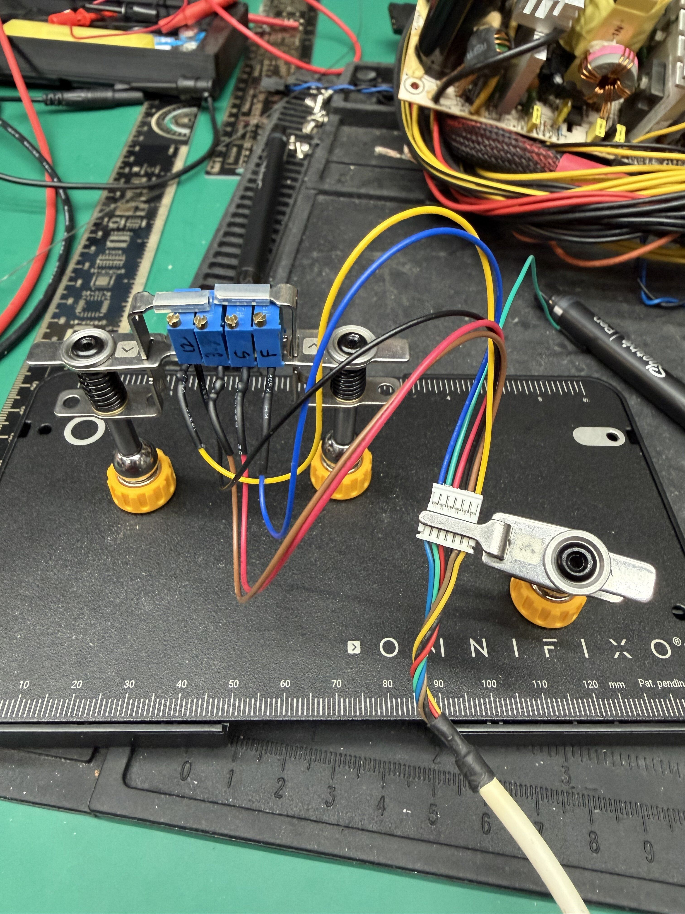
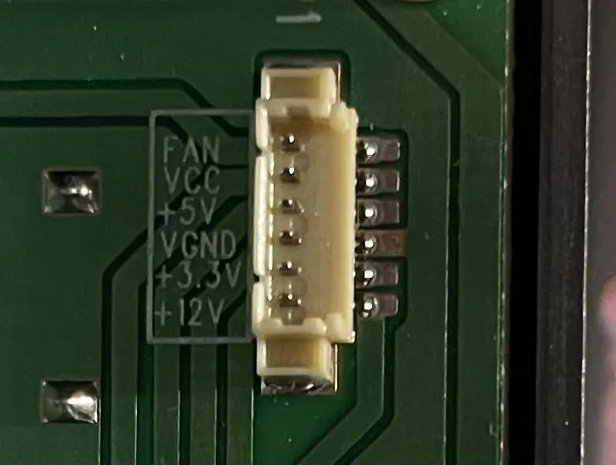
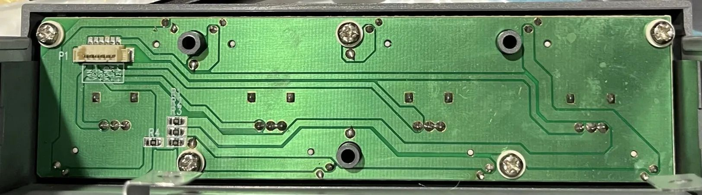
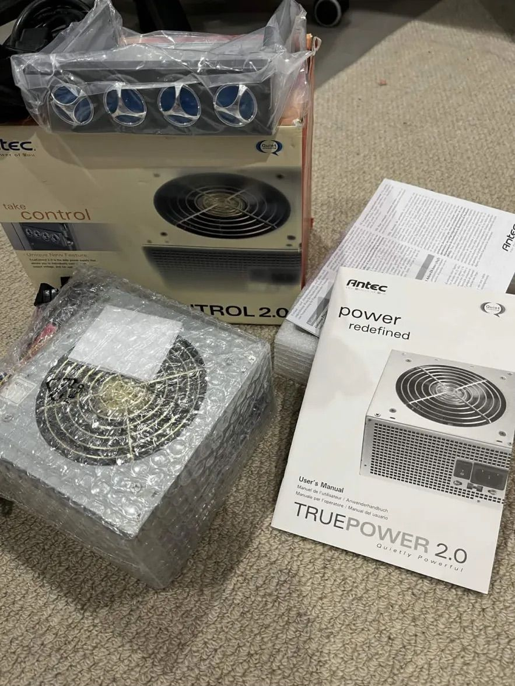
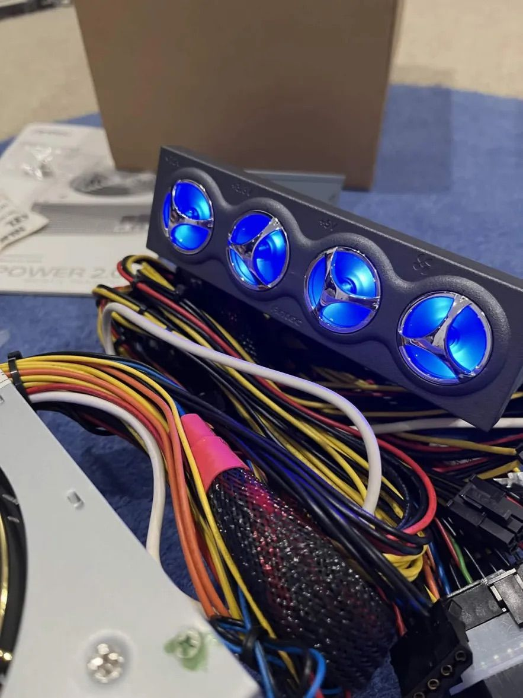

# Antec TP-II 550 Recap + Truecontrol 2.0 Control Panel Bypass

The Antec TP-II 550 is a powerful power supply that was originally offered in two variants: one with the TrueControl panel and one without. The TrueControl panel was a unique feature that mounted in a 5.25" drive bay and provided manual voltage adjustment through four potentiometers (pots) for the 12V, 5V, 3.3V, and fan voltage rails.

If you have the Truecontrol 2.0 version without the control panel—or if you've lost the original panel—you may have noticed a significant problem: the power supply defaults to voltages that are barely within ATX specification, with all rails running quite low. This makes the PSU difficult to use reliably without the control panel.

Fortunately, with some community help and reverse engineering, it's possible to build a simple replacement control circuit that restores full functionality to this beast of a power supply. This guide will walk you through creating your own TrueControl replacement using readily available components.

---

## Credits

This project was made possible thanks to the collaborative efforts of several community members:

- **@zigzagjoe** and **@mmu_man** — Identified the connector type used by the TrueControl panel
- **Mr. Cacodemon** (Power Supply Central Discord) — Provided PCB photos, pinouts, and pot measurements from an actual control panel and the caps list

---

## Recapping

Before you begin, these are almost guaranteed to need to be recapped. Below is the list of caps you'll need. I've also created a [Digikey list](https://www.digikey.com/en/mylists/list/2HG381A1MP), but it's missing the fan daughterboard cap that's usually just fine.

**General Recapping Notes:**

1. Original brands used will vary but will always be the same spec. For example the 22uf 50v is a Fuhjyyu TN instead of Koshin KRM, or the 4700uf 10v are Teapo SC instead of Fuhjyyu TM.
2. The list only applies to the non-EU models. EU models with APFC use a different platform from CWT that is the same other than the primary side which has APFC circuitry, so many of the smaller value caps will likely be different or placed in different spots.
3. See the recapping map attached to this post if you need it! This map is the same for all non-EU Truepower 2.0 Models.

| Caps (Orig → Recommended Replacement) | Notes | Qty |
|---|---|---|
| 4700uf 10v Fuhjyyu TM → 4700uf 6.3v Rubycon ZLQ | 10mm diameter | 4 |
| 3300uf 16v Fuhjyyu TM → 3300uf 16v Elite ED | These generally don't go bad, but Elite brand caps are hard to find. Two alternatives are in the Digikey list depending on what's in stock. One is 12.5mm (Panasonic FM) diameter so it'll be a tight fit but still work. Originals were 10mm. | 2 |
| 1000uf 10v Fuhjyyu TN → 1000uf 10v Rubycon ZLH | | 2 |
| 470uf 25v Fuhjyyu TN → 470uf 25v Rubycon ZLH | | 1 |
| 220uf 16v Koshin KRM → 220uf 16v Rubycon YXJ | | 1 |
| 47uf 35v Fuhjyyu TN → 47uf 35v Rubycon YXM | Chemicon LE is the equivalent if the YXM isn't in stock (any general purpose cap will work) | 1 |
| 22uf 50v Koshin KRM → 22uf 50v Rubycon YXM | Chemicon LE is the equivalent if the YXM isn't in stock (any general purpose cap will work) | 1 |
| 10uf 50v Fuhjyyu TN → 10uf 50v Rubycon YXM | Chemicon LE is the equivalent if the YXM isn't in stock (any general purpose cap will work) | 2 |
| 10uf 16v Koshin KRJ → 10uf 16v Kemet ESS | Fan daughterboard, 4x7mm | 1 |
| 1uf 50v Fuhjyyu TN → 1uf 50v Rubycon YXM | Chemicon LE is the equivalent if the YXM isn't in stock (any general purpose cap will work) | 2 |

---

## TrueControl 2.0 Bypass

### What You'll Need

**3296W Potentiometers (1/2 watt or 1/4 watt):**
- 12V rail: 4–600Ω pot (1kΩ pot works well)
- 3.3V rail: 4–1500Ω pot (2kΩ pot works well)
- 5V rail: 4–1500Ω pot (2kΩ pot works well)
- Fan line: 5400–5600Ω pot (5kΩ pot works well)
- [Example pots on Amazon](https://www.amazon.com/dp/B0CM6PJV5T)

**Connector:**
- Molex PicoBlade (0533980667) 6pin connector (available from [DigiKey](https://www.digikey.com/en/products/detail/molex/0533980667/5116074) or Amazon)
- [Amazon bundle option](https://www.amazon.com/dp/B0CL9NMVXS)

**Optional:**
- 330Ω - 4.7kΩ 805 SMD resistor for LEDs (if you want a power indicator light, resistance will depend on your brightness tolerance and color choice.)
- 3mm 5v through hole LED

---

### TrueControl Pinout

| Wire Color | Function |
|---|---|
| Yellow | 12V |
| Brown | 3.3V |
| Black | Ground (Vgnd) |
| Red | 5V |
| Green | Vcc (LED power only) |
| Blue | Fan |

---

### Assembly Instructions

**Step 1: Prepare the Potentiometers**

For each of the four potentiometers:
1. Identify pins 1, 2, and 3 on the pot
2. Connect pins 1 and 2 together — these will be your common ground connection
3. Pin 3 will be your voltage adjustment output

**Step 2: Wire to the Connector**
1. Connect the joined pins 1 & 2 from all four pots to the Black (Ground) wire on the connector
2. Connect pin 3 of each pot to its corresponding wire:
   - 12V pot → Yellow wire
   - 3.3V pot → Brown wire
   - 5V pot → Red wire
   - Fan pot → Blue wire
   - The Green (Vcc) wire is only needed if you're adding LED indicators

**Step 3: Test and Adjust**
1. Connect your assembled control circuit to the power supply connector
2. Use your BIOS readings or a multimeter to check voltages
3. Adjust each potentiometer until voltages are within proper ATX specifications:
   - Fan voltage: Adjust to preference (mine is set to about 7V). This adjustment also affects the fan-only Molex connectors.
   - You can only adjust within ATX spec (±5%). The PSU has UVP and OVP, so even if you go out of range it'll shut off.

**Step 4: Mounting**

For a temporary solution, hot glue the assembly directly to the power supply casing. A PCB design is also included in this repository for a more permanent solution.

---

While this may not be as elegant as the original TrueControl panel, it's a functional and cost-effective way to restore your Antec TP-II 550 w/ Truecontrol to full working order. The total cost in components is minimal, and the assembly is straightforward enough for anyone comfortable with basic soldering.

Happy building, and enjoy your newly functional power supply!

---

## General Notes on the TruePower Line

The Antec TruePower 2.0 line was a high-end set of models released in 2005 to replace the original TruePower line. The TruePower 2.0 had four different versions:

- **Standard models** available in 4 wattages: TPII-380, TPII-430, TPII-480, TPII-550
  *(APFC EU models: TPII-380P, TPII-430P, TPII-480P, TPII-550P)*
- **EPS12V model** for server use: TP2-550EPS12V *(APFC EU model: TP2-550PEPS12V)* — the only 2.0 model with dual fans like the original TruePower models
- **TRUE Blue 2.0 model**: TPII-480 Blue *(APFC EU model: TPII-480P Blue)* — same as the standard 480W model but with a clear fan and blue LEDs
- **TRUE Control 2.0 model**: TPII-550 Control *(APFC EU model: TPII-550P Control)* — TPII-550 with a 5.25" bay control panel for fine voltage adjustment for overclocking and fan speed override control

---

---

*Original post by mitchkramez on [TinkerDifferent](https://tinkerdifferent.com/threads/antec-tp-ii-550-recap-truecontrol-2-0-control-panel-bypass.5222/)*
